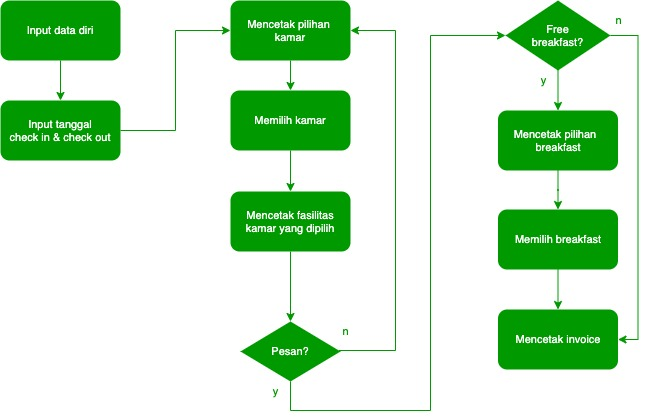
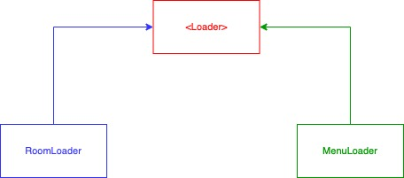

    

    
    

Our Rooms adalah aplikasi untuk pemesanan kamar hotel. Our Rooms memiliki fitur untuk menampilkan tipe kamar dan menampilkan fasilitas berbeda di setiap kamarnya.

Aplikasi ini dibuat untuk memudahkan para pelanggan ketika memesan kamar hotel dan juga akan meminimalisir menumpuknya antrian. Our Rooms ini memiliki fitur untuk menampilkan tipe kamar dan menampilkan fasilitas berbeda di setiap kamarnya.

# OurRooms App - Fitur Pemesanan
## BDD Specs

### Story: Tamu yang hendak check-in

### Narrative #1

> Sebagai user  
> Saya ingin aplikasi otomatis menampilkan daftar kamar  
> Sehingga saya dapat melihat daftar kamar  

### Narrative #2

> Sebagai user  
> Ketika saya memilih kamar dari daftar kamar  
> Aplikasi akan menampilkan fasilitas lebih detail dari kamar  
> Sehingga saya bisa mendapatkan informasi dari kamar tersebut  

## Use Cases

### Load Room List Use Case

#### Data:
- JSON

#### Primary course (happy path):
1. Mengeksekusi perintah "Load Room List" dengan data di atas.
2. Sistem akan mengurai data dari json.
3. Sistem mengirim data room list.

#### Invalid data – error course (sad path):
1. Sistem menampilkan error.

#### No connectivity – error course (sad path):
1. Sistem menampilkan error.

## Model Specs

### Room

| Property      | Type                |
|---------------|---------------------|
| `id`          | `int`              |
| `name` | `String`  |
| `facilities`    | `String[]`               |
| `price`    | `int` |
| `breakfast`    | `boolean`  |

### Menu List Use Case

#### Data:
- JSON

#### Primary course (happy path):
1. Mengeksekusi perintah "Load Menu List" dengan data di atas.
2. Sistem akan mengurai data dari json.
3. System mengirim data Menu list.

#### Invalid data – error course (sad path):
1. Sistem menampilkan error.

#### No connectivity – error course (sad path):
1. Sistem menampilkan error.

## Model Specs

### Menu

| Property      | Type                |
|---------------|---------------------|
| `id`          | `int`              |
| `name` | `String`  |

## Flowchart

## Polymorphism Diagram

## Materi yang digunakan
- Generics
- Class
- Abstraction (Interface)
- BufferedReader
- Method
- Looping (While, For i, For each)
- PBO (Abstraction (Interface), Encapsulation, Polymorphism)
- Exception
- If else
